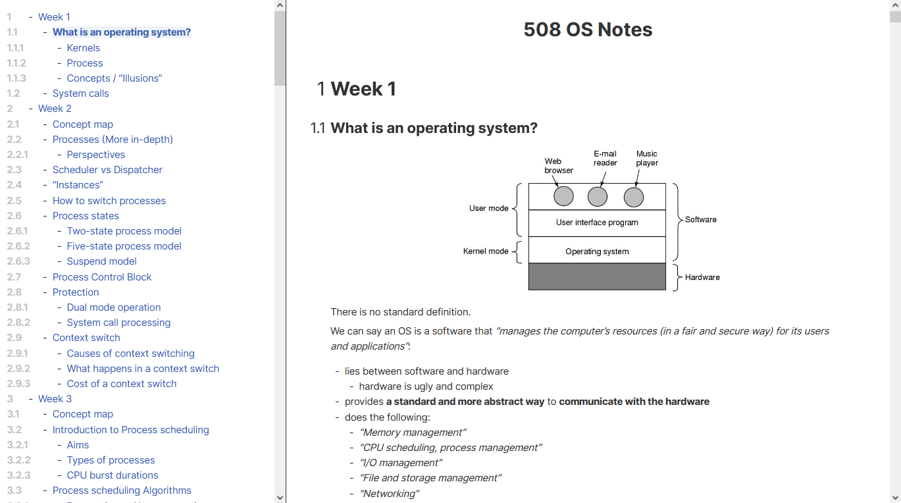
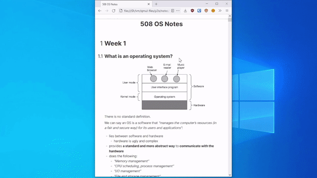

# Notebook styles for Pandoc





This contains CSS styles for use in Markdown files with Pandoc. I personally use this style for my university notes, hence the prefix `qmul`.

This is designed for standalone pages with terms of contents, so these Pandoc arguments should be used when generating a `.html` file:

- `-t html` - set output format to HTML
- `--standalone` - Produce a standalone HTML file
- `--toc` - Include a TOC in the output file
- `--number-sections` - Number each header sequentially
- `--columns 99999999999999` - Pandoc does something weird to HTML tables by default, this overrides whatever Pandoc is doing

Here is an example command used to generate a standalone page with the notebook styling:

```bash
pandoc input-file.md \
       -f markdown \
       --toc \
       --number-sections \
       -c file://C:/Resources/html/qmul-notes.css \
       -t html \
       -o output-file.html \
       --standalone \
       --highlight-style kate \
       --columns 99999999999999
```

## Javascript to auto-scroll in the TOC

```yaml
---
header-includes: |
  <script src="file:///C:/Resources/html/qmul-script-scroll.js"></script>
---
```

To make the TOC scroll and focus automatically like in the demo, include the `.js` script in the output HTML. I usually add a YAML block at the start of the document and use `header-includes` to include the script in the page header.
